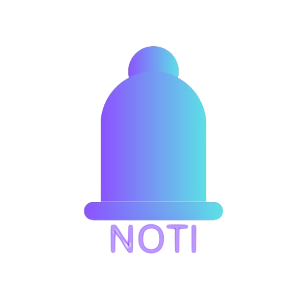

# Noti Car Notification Simulation

## Overview

The Car Simulation & Notification Dashboard is a real-time web application that simulates car telemetry and displays notifications as they arrive via RabbitMQ. The application mimics a car by periodically updating its location, battery level, and timestamp. These updates are published using the AMQP protocol over WebSockets to a RabbitMQ instance. Incoming messages—including various system notifications like ACKs, warnings, errors, or custom messages—are rendered live on an animated dashboard.

In addition, you can manually send custom notifications through a built-in modal form that triggers calls to an HTTP API. This gives you full control over testing and interacting with the notification flow.

The project leverages modern web technologies including:

- Vite
- TypeScript
- React
- shadcn-ui
- Tailwind CSS

## Backend Service

The backend service for the APIs and RabbitMQ broker can be found [here](https://github.com/marcusnagy/noti-rabbitmq-service).

## Features

- **Real-Time Car Simulation:**  
Simulates a car that updates its telemetry (location, battery status, timestamp) every few seconds. These changes are automatically published to a RabbitMQ exchange.

- **Live Notification Consumption:**
Subscribes to both car notifications and general notifications from RabbitMQ, displaying them in an animated list on the dashboard. Each notification is processed and, if necessary, acknowledged (when configured).

- **Custom Notification Sending:**
Includes a modal-based form that allows users to send their own notifications via an HTTP API call. This can be used for testing or for triggering specific alerts.

- **Resilient Messaging:**
The application establishes and manages a RabbitMQ connection, handling errors and automatic reconnections as needed.

## Getting Started

### Prerequisites

- Node.js (v14.x or later)
- npm

### Installation

1. **Clone the repository:**

```sh
git clone https://github.com/marcusnagy/Noti-Car-Notification-Sim.git
cd Noti-Car-Notification-Sim
```

2. **Navigate to the project directory:**

```sh
cd Noti-Car-Notification-Sim
```

3. **Install dependencies:**

```sh
npm install
```

4. **Start the development server:**

```sh
npm run dev
```

### Configuration

- **RabbitMQ Connection Settings:**  
The RabbitMQ client is configured in `src/services/RabbitMQService.ts`. By default, the connection is set to use WebSockets on ports 15675 (for WSS) or 15670 (for WS) based on the browser protocol. Update these settings if your RabbitMQ instance is running elsewhere.

- **Notification API:**
The custom notification functionality uses an HTTP API (proxied at `/api`) defined in `src/services/NotificationService.ts`. Ensure that your backend notification service is operational and accessible.


## Project Structure

```
/src
  /components       # UI components and modals (e.g., Notification Modal, Animated List)
  /hooks            # Custom hooks (e.g., for toast notifications)
  /pages            # Main pages (e.g., Index for simulation dashboard, NotFound)
  /services         # Messaging services (RabbitMQClient) and API integrations (NotificationService)
  /types            # TypeScript types and interfaces for notifications
```

## Usage

1. **Starting the Simulation:**  
Click the "Start Simulation" button on the main page. This action instantiates a simulated car that publishes metadata (location, battery, and timestamp) every 5 seconds to a RabbitMQ exchange.

2. **Viewing Notifications:**

   As the simulation runs, notifications are consumed from the bound queues in RabbitMQ and displayed in an animated list. Notifications can range from acknowledgments to error messages, depending on the system state or custom inputs. 

3. **Sending Custom Notifications:**

   Open the "Send Notification" modal to create and dispatch a custom notification through the Notification Service. This is helpful for testing or triggering specific behaviors within the system.

4. **Stopping the Simulation:**

   Click "Stop Simulation" to clear data from the dashboard and disconnect from the RabbitMQ server.


## Deployment
To build the production version of the application:

```sh
npm run build
```
